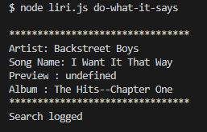

# liri-node-app
 * LIRI will search Spotify for songs, Bands in Town for concerts, and OMDB for movies.
 1. This bot solves the option of searchong for  a track from Spotify or search for events or a movie all in one place

2. High-level overview 
    * this app makes use of OMDB for movie search, Spotify for track search and bandsintown-api for artist search
    * based on your search input, the relavant details will be displayed
3. Instructions to run the app
    ## For song search
    
        * type 'node liri.js' followed by 'concert-this' followed by your artist search
        * example 'node liri.js spotify-this-song shallow'' will result in 
     
    

        * if no artist is specified, default track will be 'Ace of Base'
    
    

    ## For event search
   
        * type 'node liri.js' followed by 'concert-this' followed by the artist you want to search.
        * example 'node liri.js concert-this guy sebastian' will result in 
    
    
    ## For movie search
    
        * type 'node liri.js' followed by 'movie-this' followed by the artist you want to search.
        * example 'node liri.js movie-this matrix' will result in 
    
         * if no artist is specified, default track will be 'Ace of Base'
    
    
    ## 4th option of search
    
        * type 'node liri.js' followed by 'do-what-it-says'
        * example 'node liri.js do-what-it-says' will result in 
    
    
        * How does this work? - This is for you to find out.(HINT: check random.txt)

         
